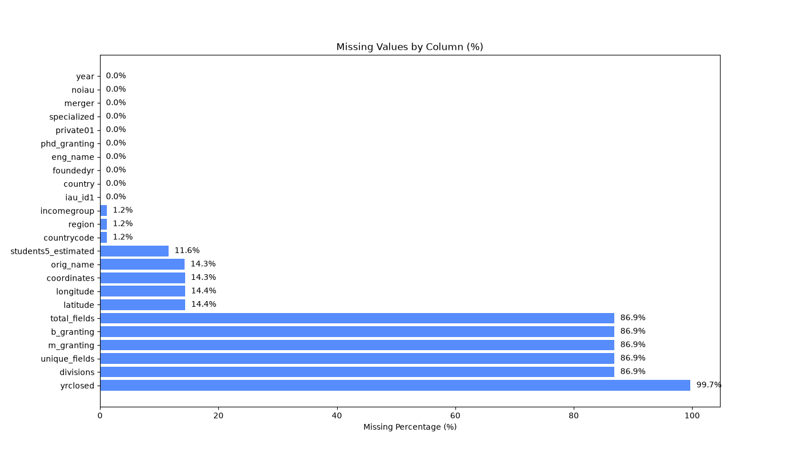
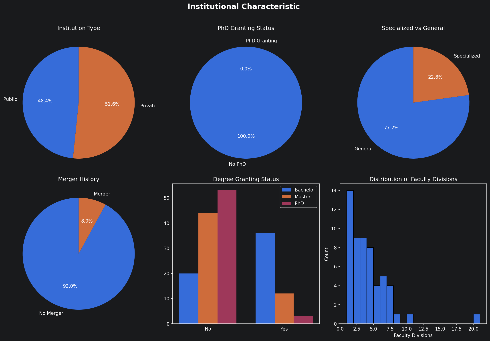
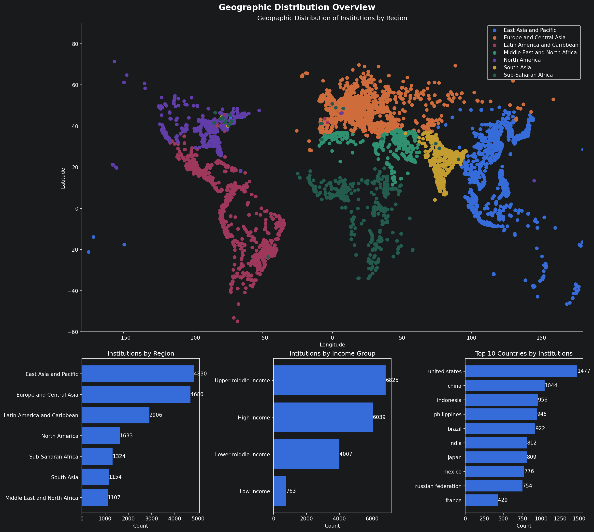
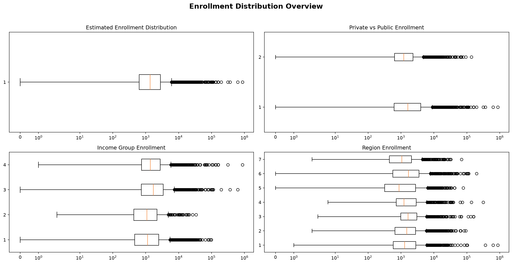
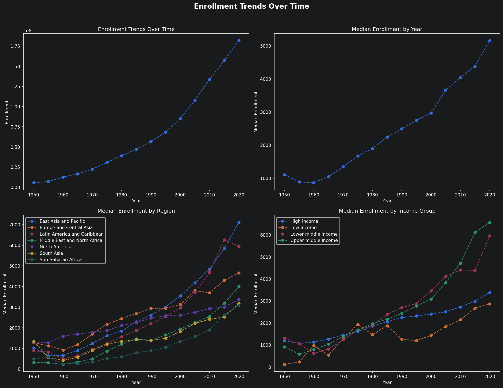
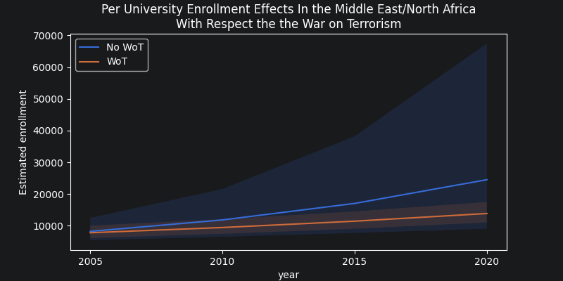
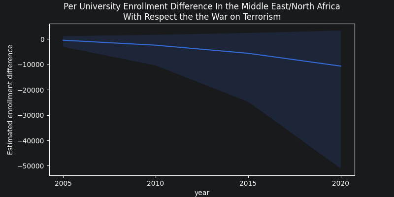
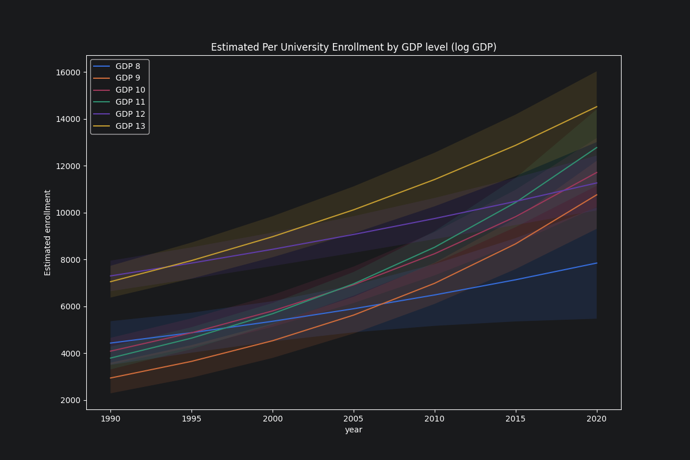
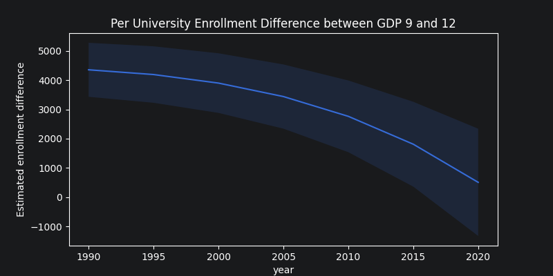

# Initial Exploration and Analysis Report

This report summarizes the findings from the exploration and analysis of the university enrollment dataset.

---

## 1. Data Exploration (01_exploration.ipynb)

The initial exploration focused on data cleaning, understanding the dataset's structure, and identifying key institutional and geographic trends.

### Data Cleaning and Quality
- **Cleaning**: Malformed country names were fixed, and empty records (missing years) were removed.
- **Missing Values**: Several columns exhibit high percentages of missing data, particularly those related to specific institutional attributes.
  - Granting was often missing. Fields and divisions were also often missing.

### Institutional Characteristics
- Analysis of the most recent data (pre-2020) reveals a mix of public and private institutions, with varying statuses for PhD granting and specialization.
  - pre-2020 was selected because some values stopped being tracked in 2020 (as per schema).
- PhD granting is very low, but not missing. This seems off to me.
  - Possibly NaN values were imputed as 0 at some point and corrupting this element.
- Otherwise, these all seem fair.

### Geographic Distribution
- The dataset covers a wide range of regions and income groups.
- Indonesia, Phillipines, and Brazil had more universities that I expected.
- Some Universities also look to have bad longitude/latitude values.

### Enrollment Trends
- Some Universities are quite large, and some are rather small.
- Overall enrollment shows a steady increase over time.

---

## 2. War on Terror Effects on Enrollment in MENA (02_personal_analysis.ipynb)

This analysis specifically examined the Middle East and North Africa (MENA) region from 1985 onwards, focusing on the impact of the "War on Terrorism" (defined as post-2000) on university enrollment.

### Statistical Approach
- **Method**: GEE Poisson regression was used to account for the clustered nature of the data (by institution) and its temporal component.
- **Model**: `students5_estimated ~ year * wot`

### Key Findings
- **Impact of WoT**: The "War on Terrorism" indicator showed a positive initial effect on enrollment levels in the MENA region.
- **Temporal Effect**: However, the time elapsed since the start of the WoT showed a non-significant negative impact on the growth rate compared to the pre-2000 trend.

---

## 3. GDP vs. Enrollment Analysis (03_gdp_vs_enrollment.ipynb)

This section investigated the relationship between a country's GDP and its university enrollment levels from 1990 to 2020.

### Statistical Approach
- **Data Integration**: Enrollment data was merged with global GDP data. GDP was analyzed on a log10 scale to handle the wide range of values and reflect diminishing returns.
- **Method**: GEE Poisson regression.
- **Model**: `students5_estimated ~ year * C(GDP)`

### Key Findings
- **GDP Correlation**: Higher GDP is strongly associated with higher per-university enrollment.
- **"Catching Up" Effect**: Interestingly, there is a temporal "catching up" effect where universities in countries with lower GDP are seeing faster relative growth in enrollment.
- **Interpretation**: While wealth remains a major factor in accessing higher education, the decreasing cost of information and increased demand for white-collar skills may be driving growth in lower-GDP nations.

